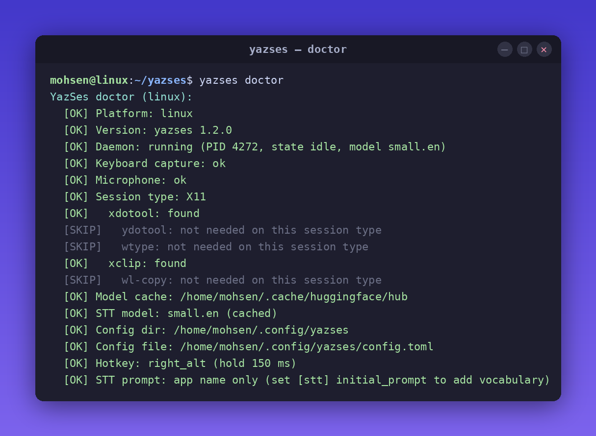

# YazSes

[](https://github.com/MSKazemi/yazses/actions/workflows/test.yml)
[](https://pypi.org/project/yazses/)
[](https://snapcraft.io/yazses)
[](LICENSE)

**Hold a key → speak → release.** On-device voice dictation that types into any app, plus voice commands and macros — entirely offline. No cloud. No API key. No subscription.

YazSes is an open-source, offline voice-dictation daemon for Linux, macOS, and Windows. It transcribes your speech locally with [faster-whisper](https://github.com/SYSTRAN/faster-whisper) and types the result into whatever window has focus. Use it when you want hands-free dictation and editor/terminal voice commands without sending audio to Google, Apple, or Microsoft.



---

## Two versions of YazSes

This repo holds **one product** with **two implementations** — not two separate apps, but two generations of the same idea. The one you install and run is **Part 1 (Python)**, on this `main` branch.

| | **Part 1 — Python** · `main` | **Rust HCI exploration** · `archive/rust-hci-v1` |
|---|---|---|
| What it is | The shipping app — voice dictation, commands, macros | An early-stage rewrite exploring deeper **human–computer interaction**: an on-device *agent* (LLM tool-use, personal memory, editor awareness) |
| Status | ✅ **Active — current product** (v1.2.0, installed & maintained) | ⏸️ **Paused / archived** — not shipped, not installable |
| Hold-to-talk dictation | ✅ | ✅ |
| Offline STT | ✅ faster-whisper (CPU int8) | ✅ Whisper + Moonshine v2 (~9 ms) |
| Voice commands | ✅ regex grammar (+ optional SLM router) → key sequences | ✅ via LLM tool-calls |
| Voice macros · Mid-Thought Undo · Punch-In · Prosody Ink · Ghost Ahead | ✅ | ❌ |
| Dysfluency-Friendly Mode · learning corpus + `yazses tune` | ✅ | ❌ |
| Friendly CLI (`-h`, examples, `yazses update`) | ✅ | ❌ |
| On-device **LLM agent** (OS tools: git commit, media, notes, screenshots…) | ❌ (optional offline text *cleanup* only) | ✅ |
| **Personal memory** (encrypted on-device vector store) | ❌ | ✅ |
| Editor context (Neovim / VS Code) | ✅ LSP context, opt-in | ✅ 5-tier window detection + bridges |
| Screen-reader integration (AT-SPI / NVDA) | ❌ | ✅ |
| Packaged & distributed (PyPI, snap, APT) | ✅ | ❌ |

**Bottom line:** if you want YazSes, use **Part 1** (this branch) — an offline dictation + voice-command daemon. The Rust branch is kept only for reference; nothing on `main` builds, installs, or depends on it. The Rust effort aimed at a more ambitious agentic HCI layer but was left in early stages — revisiting it is a deliberate future decision, not part of day-to-day work here.

---

## Quick Start

**Step 1 — Install** (see [all install options](#all-install-options) for every platform)

| Platform | Command |
|---|---|
| **Linux** (Debian/Ubuntu) | `bash <(curl -fsSL https://raw.githubusercontent.com/MSKazemi/yazses/main/install-apt.sh)` |
| **Linux** (any distro) | `sudo snap install yazses` |
| **Any OS** (Python ≥ 3.11) | `pipx install yazses` |

**Step 2 — Set up**

```sh
yazses doctor               # check mic, injection backend, permissions
yazses enroll               # calibrate your microphone (~30 seconds)
yazses start                # start the dictation daemon
```

**Step 3 — Use it** — hold the hotkey, speak, release. The text is typed into the focused app.

| OS | Hold this key | Say… |
|---|---|---|
| Linux | `Space` | *"the quick brown fox"* (types it) · *"go to line 42"* · *"run the tests"* |
| macOS | `Right Option` | *"delete the last word"* · *"save file"* · *"new function parse config"* |
| Windows | `Right Ctrl` | *"undo that"* · *"select all"* · *"comment this line"* |

Release the key — YazSes transcribes and acts within about a second.

> **First time on macOS?** v0 builds are unsigned: right-click the app → Open (Gatekeeper), then grant Accessibility + Microphone when prompted.
>
> **First time on Windows?** If SmartScreen warns you, click **More info → Run anyway**.
>
> **First time on Linux?** Run `sudo usermod -aG input "$USER"` and re-login before starting.

---

## What you can say

Hold the key and just **talk** — by default everything you say is typed at the cursor. YazSes also recognises a set of **voice commands** (a fast regex grammar; an optional ~0.5B SLM router catches phrasings the grammar misses) that map to editor/terminal **key sequences** instead of being typed:

| Say something like… | What happens |
|---|---|
| *"the quick brown fox"* | Types the text at the cursor (dictation) |
| *"delete the last three words"* | Deletes the last 3 words |
| *"undo that"* / *"undo five times"* | Sends undo |
| *"save file"* · *"copy"* · *"paste"* | Save / copy / paste |
| *"select all"* · *"select to end"* | Selection commands |
| *"comment this line"* | Toggles a comment |
| *"go to line 42"* | Jumps to line 42 |
| *"go to function parse_config"* | Jumps to the symbol (via LSP, opt-in) |
| *"run the tests"* / *"run the build"* | Runs the editor/terminal action |
| *"rename this to user_id"* | Renames the symbol |

You can also define multi-step **macros** and a personal **vocabulary** of mis-heard words — see the [CLI reference](docs/cli-reference.md).

---

## How it works

```
Hold hotkey → record audio → VAD gate → faster-whisper (CPU) → clean + disfluency filter
            → command grammar (Tier 1 regex, optional Tier 2 SLM router)
            → dictate? type the text   ·   command? send the key sequence
```

Everything runs on your CPU — no GPU, no network. Transcription uses **faster-whisper** (int8). A fast regex grammar classifies each utterance as dictation or a command; when its confidence is low, an optional ~0.5B SLM router takes a second look. The result appears in the focused window within about a second on a modern laptop.

**Models:**
- **Speech-to-text:** faster-whisper — `tiny.en` (fast) / `base.en` / `small.en` (more accurate), int8 on CPU
- **Command routing (optional):** Qwen2.5-0.5B SLM for Tier 2 intent classification — *not* required for dictation, fetched with `yazses model download`
- **Dictation cleanup (optional, off by default):** a small offline LLM can tidy grammar/punctuation; length- and token-preservation guards stop it rewriting meaning

---

## Requirements

| | |
|---|---|
| **OS** | Linux (primary) · macOS 11+ · Windows 10 (21H2)+ |
| **RAM** | 4 GB minimum · 8 GB comfortable |
| **Disk** | ~250 MB–1 GB for the faster-whisper model (downloaded on first run) |
| **CPU** | 2+ cores · no GPU required |
| **Mic** | Any USB or built-in microphone |

---

## Key features

- **Fully offline** — no audio, no text, nothing leaves the machine by default; no cloud, API key, or subscription
- **Hold-to-talk dictation** — type into any focused app on Linux, macOS, or Windows
- **Voice commands** — editor/terminal actions (undo, save, go-to-line, run tests, rename…) via regex grammar + an optional SLM router
- **Macros & personal vocabulary** — define multi-step commands and teach YazSes your mis-heard words
- **Dysfluency-Friendly Mode** — opt-in collapse of stutters/repeats (`b-b-because` → `because`) for stuttered or dysarthric speech
- **Self-improving** — opt-in, encrypted on-device learning corpus; `yazses tune` proposes accuracy fixes from your own corrections (nothing leaves the machine)
- **Editor context** — optional Neovim / VS Code LSP context improves accuracy on code identifiers
- **Accessibility** — VAD calibration wizard, mic-level tuning, and EMG (muscle-sensor) trigger support for motor-disability use
- **Voice-activity overlay** — optional sonar rings near the cursor while you speak

---

## Limitations / when *not* to use YazSes

- **Not an LLM agent.** YazSes dictates text and runs editor/terminal commands. It does **not** browse, reason over your files, set timers, or hold a conversation — that was the paused Rust exploration (see *Two versions* above).
- **CPU faster-whisper, not a cloud service.** For the absolute lowest word-error rate on a noisy mic, a cloud STT may still beat it; the trade-off is that nothing leaves your machine.
- **English-tuned by default.** It ships with `*.en` Whisper models; other languages need a different model.
- **Desktop only.** No mobile or web build.

---

## CLI commands

| Command | Description |
|---|---|
| `yazses start` | Start the YazSes daemon in the background (restarts cleanly if one is already running) |
| `yazses restart` | Stop all daemons (including detached) and start exactly one |
| `yazses stop` | Stop the running daemon |
| `yazses status` | Show daemon status — queries the daemon over IPC when reachable |
| `yazses doctor` | Check prerequisites (version, daemon, model, mic, injection backend, permissions) |
| `yazses enroll` | Calibrate your microphone — tunes `vad_threshold` for your voice and room |
| `yazses mic-level` | Measure mic speech level and recommend (or `--set`) the VAD threshold |
| `yazses features` | List capabilities and toggle them (`enable`/`disable <name>`) |
| `yazses vocab` | Personal dictionary of mis-heard words (`add`/`list`/`remove`) |
| `yazses hotkey` | Show or change the hold-to-talk key (`set`) and the dedicated command key (`command`) |
| `yazses overlay` | Launch the sonar voice-activity overlay (requires the `overlay` extra) |
| `yazses inject TEXT` | Type arbitrary text into the focused window — test injection without speaking |
| `yazses say TEXT` | Speak text aloud (offline TTS) |
| `yazses test` | End-to-end self-test: focuses a window and types `YazSes OK` |
| `yazses logs` | Show the daemon diagnostic log (metadata only — no dictated text is stored) |
| `yazses mark-wrong` | Flag the last dictation as a misrecognition (feeds the learning corpus) |
| `yazses tune` | Analyse the learning corpus and propose accuracy improvements; `--apply` to write changes |
| `yazses corpus` | Manage the local learning corpus (`status`, `forget`, `destroy`) |
| `yazses model` | List or download the optional SLM intent-routing model |
| `yazses remote HOST` | Forward voice typing to a remote host over SSH |

---

## Configuration

Config file location:

| OS | Path |
|---|---|
| Linux | `~/.config/yazses/config.toml` |
| macOS | `~/Library/Application Support/yazses/config.toml` |
| Windows | `%APPDATA%\yazses\config.toml` |

Prefer `yazses features` / `yazses hotkey` / `yazses vocab` to edit config safely (they preserve comments). Essential settings:

```toml
[stt]
model = "small.en"          # tiny.en (fast) | base.en | small.en (accurate); CPU int8
initial_prompt = ""         # vocabulary/context primed into Whisper

[hotkey]
key = "space"               # hold-to-talk key (yazses hotkey set <key>)
command_key = ""            # optional dedicated key that forces command mode
hold_threshold_ms = 500     # how long to hold before recording starts

[audio]
sample_rate = 16000
max_record_seconds = 90

[injection]
backend = "auto"            # auto | xdotool | ydotool | wtype | clipboard

[accessibility]
vad_threshold = 0.0008      # lower for quiet speech, raise if room noise triggers (yazses mic-level --set)
```

See the [CLI reference](docs/cli-reference.md) and [`examples/config.example.toml`](examples/config.example.toml) for all options.

### Microphone not working?

If YazSes does nothing and the log shows `Silent audio -- discarding`, your speech is below the VAD threshold:

```sh
yazses mic-level --set   # measure your voice and set the right threshold
yazses restart
```

---

## All install options

### Linux

```bash
# APT script — Debian / Ubuntu (recommended)
bash <(curl -fsSL https://raw.githubusercontent.com/MSKazemi/yazses/main/install-apt.sh)

# Snap — any distro (strict confinement; keystroke injection works on X11.
# On Wayland, prefer pipx below for full input access.)
sudo snap install yazses

# pipx — any distro with Python ≥ 3.11
sudo apt install libportaudio2 xdotool xclip pipx   # Debian/Ubuntu runtime deps
pipx install yazses
```

### macOS

```sh
# pipx (Python ≥ 3.11)
pipx install yazses

# App bundle (.dmg) — unsigned developer preview
# https://github.com/MSKazemi/yazses/releases/latest
```

### Windows

```powershell
# pipx (Python ≥ 3.11)
pipx install yazses

# Installer (.exe) — unsigned developer preview
# https://github.com/MSKazemi/yazses/releases/latest
```

---

## Documentation

| | |
|---|---|
| [Install on Linux](docs/install-linux.md) | Detailed Linux guide — permissions, injection backends, service setup |
| [Install on macOS](docs/macos-install.md) | Gatekeeper, Accessibility, Microphone permissions |
| [Install on Windows](docs/windows-install.md) | SmartScreen, antivirus exceptions, privacy settings |
| [CLI reference](docs/cli-reference.md) | All commands and flags (incl. macros & vocabulary for custom voice commands) |
| [Privacy statement](docs/privacy-statement.md) | What stays on-device, what is never collected |

---

## Development

YazSes (Part 1) is a Python project managed with `uv`:

```bash
git clone https://github.com/MSKazemi/yazses
cd yazses
uv sync
uv run python -m pytest tests/ -v
bash scripts/install-local.sh        # install locally + run as a user service
```

### Rust HCI exploration (archived)

The early-stage Rust rewrite lives on the **`archive/rust-hci-v1`** branch, not on
`main`. It is not built or installed by anything here — see *Two versions of
YazSes* above for what it does and doesn't have. To look at it:

```bash
git checkout archive/rust-hci-v1
cargo build && cargo test --workspace   # optional backends: whisper, moonshine, llama-cpp, ollama, silero
```

---

## License

Apache 2.0 — see [LICENSE](LICENSE).

If YazSes is useful to you, a ⭐ on GitHub and a mention in your project, blog, or talk is the best way to support continued development.
